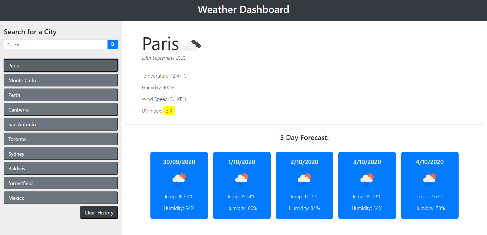

# 06 Server-Side APIs: Weather Dashboard
UWA Project, Week 6



## Project Description
For this project we needed to make a Weather Dashboard, that we can search for a City using the openweathermap API returning the temperature, humidity, UV index, wind speed and a 5 day forecast. The cities needed to be added to a search history for easy re-searching.

The main goal was:
```
AS A traveler
I WANT to see the weather outlook for multiple cities
SO THAT I can plan a trip accordingly
```

## Acceptance Criteria

```
GIVEN a weather dashboard with form inputs
WHEN I search for a city
THEN I am presented with current and future conditions for that city and that city is added to the search history
WHEN I view current weather conditions for that city
THEN I am presented with the city name, the date, an icon representation of weather conditions, the temperature, the humidity, the wind speed, and the UV index
WHEN I view the UV index
THEN I am presented with a color that indicates whether the conditions are favorable, moderate, or severe
WHEN I view future weather conditions for that city
THEN I am presented with a 5-day forecast that displays the date, an icon representation of weather conditions, the temperature, and the humidity
WHEN I click on a city in the search history
THEN I am again presented with current and future conditions for that city
WHEN I open the weather dashboard
THEN I am presented with the last searched city forecast
```

## Link to Deployed Application
https://diemrbond.github.io/WeatherDashboard

## Author
Andrew Kelleher 
www.github.com/diemrbond